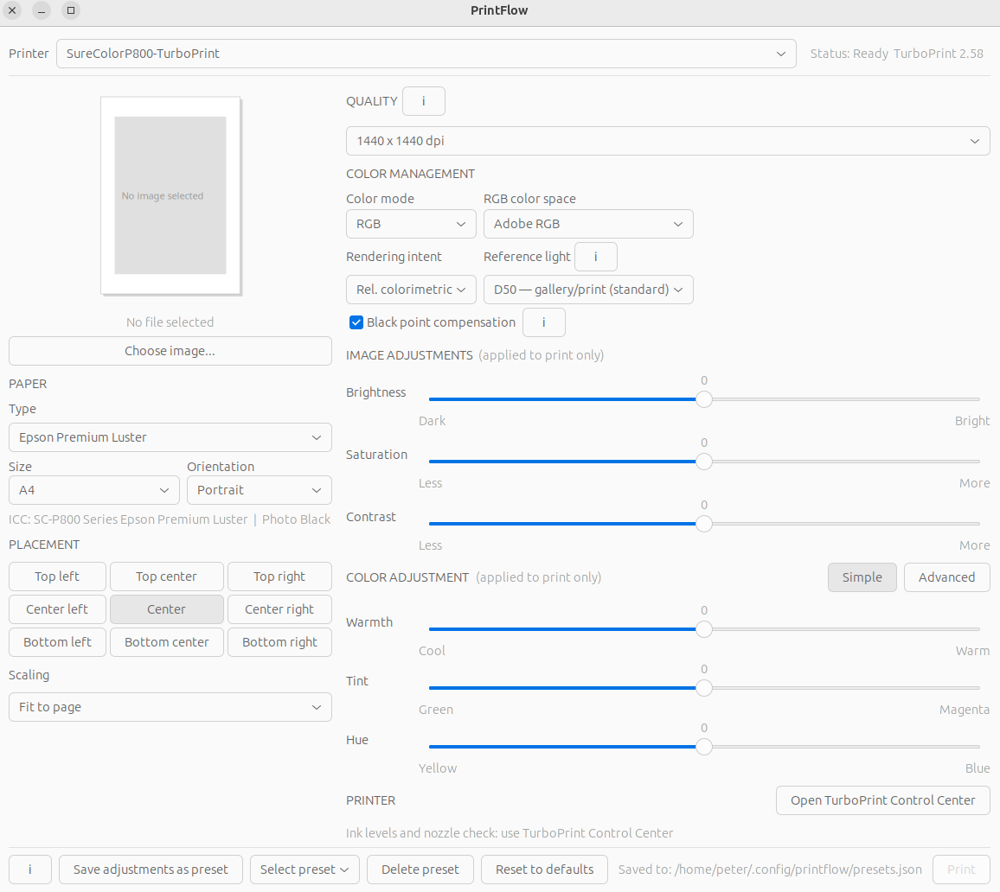

# PrintFlow

**Photo print manager for Linux — a TurboPrint frontend for photographers.**



PrintFlow gives photographers a clean, focused interface for printing photos on Linux using TurboPrint. Instead of navigating scattered dialogs across GIMP and TurboPrint, everything you need is in one window.

---

## Background

I'm Peter, a hobby photographer who shoots on film and scans the negatives. Printing photos on Linux has always worked — but the workflow was fragmented. Paper type, ICC profiles, image adjustments, placement, and quality settings were spread across multiple dialogs in GIMP and TurboPrint.

PrintFlow started as a personal tool to bring everything together in one place. I hope it saves other photographers on Linux the same friction I was dealing with.

This project was built together with [Claude](https://claude.ai) (Anthropic's AI assistant). Testing, feedback, and contributions are very welcome.

> **See also:** [ColorFlow](https://github.com/yourusername/colorflow) — a companion tool for checking and managing your color management setup on Linux.

---

## What does it do?

PrintFlow provides a single window for photo printing on Linux via TurboPrint:

- **Paper type selection** — automatically sets the correct ICC profile and ink type (Photo Black or Matte Black) for the selected paper
- **Paper simulation** — visual preview showing how your image will be placed on the paper
- **3×3 placement grid** — choose exactly where on the paper your image appears
- **Scaling modes** — fit to page, actual size, or fill paper
- **Quality selection** — shows actual DPI values available for the selected paper type, updated dynamically
- **Color management** — rendering intent, reference light (D50/D65/D80), and black point compensation
- **Image adjustments** — brightness, saturation, and contrast (applied to print only)
- **Color adjustment** — Simple mode (Warmth/Tint/Hue) or Advanced mode (Cyan/Magenta/Yellow/Black)
- **Presets** — save and restore all settings for a specific paper/workflow combination
- **TurboPrint Control Center** — direct access for ink levels and nozzle check

---

## Requirements

- Linux with GNOME (tested on Ubuntu 24.04 LTS)
- [TurboPrint](https://www.turboprint.info/) — required (commercial, ~€35 one-time license)
- Python 3.8 or later
- GTK 3 Python bindings: `python3-gi`
- Cairo Python bindings: `python3-gi-cairo`
- ImageMagick: `imagemagick`

Install Python/GTK requirements on Ubuntu/Debian:

```bash
sudo apt install python3-gi python3-gi-cairo gir1.2-gtk-3.0 imagemagick
```

TurboPrint must be installed and configured separately. See [turboprint.info](https://www.turboprint.info/) for installation instructions.

---

## Installation

Clone the repository and run the installer:

```bash
git clone https://github.com/Kalifornia1979/printflow.git
cd printflow
bash install.sh
```

The installer will:
- Copy `printflow.py` to `~/.local/bin/`
- Copy the icon to `~/.local/share/icons/`
- Create a desktop entry so PrintFlow appears in your applications menu

After installation, find PrintFlow in your applications menu or run it directly:

```bash
python3 ~/.local/bin/printflow.py
```

---

## Uninstall

```bash
rm ~/.local/bin/printflow.py
rm ~/.local/share/icons/printflow.svg
rm ~/.local/share/applications/printflow.desktop
```

---

## Known issues and limitations

- **Color accuracy** — ICC profiles are handled by TurboPrint internally. The color pipeline is functional but print output may not perfectly match screen. This is an area of active development.
- **Placement** — image placement on paper is partially implemented. Centering may not be exact on all paper sizes. Under development.
- **Ink levels** — not available over network connections. Use TurboPrint Control Center (via the button in the app) for ink levels and nozzle check.
- **Fill paper with crop** — fill paper mode is available in the preview, but crop adjustment is not yet implemented.
- **Printer support** — currently optimized for Epson SureColor P800. Other TurboPrint-supported printers should work but have not been tested.

---

## Roadmap

- Fix color pipeline for accurate ICC-managed printing
- Fix image placement on paper
- Fill paper mode with interactive crop editor
- Broader printer support and testing
- Progress indicator during printing

---

## Contact

- **GitHub Issues** — for bug reports, feature requests, and questions: [open an issue](../../issues)
- **Email** — pkr1979@pm.me

---

## License

MIT License — free to use, modify, and share.

---

## Credits

Built by Peter Risholm with [Claude](https://claude.ai) (Anthropic). Printing via [TurboPrint](https://www.turboprint.info/) by ZEDOnet GmbH.
